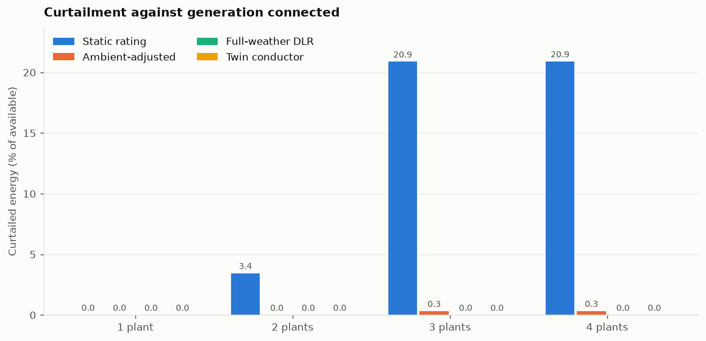
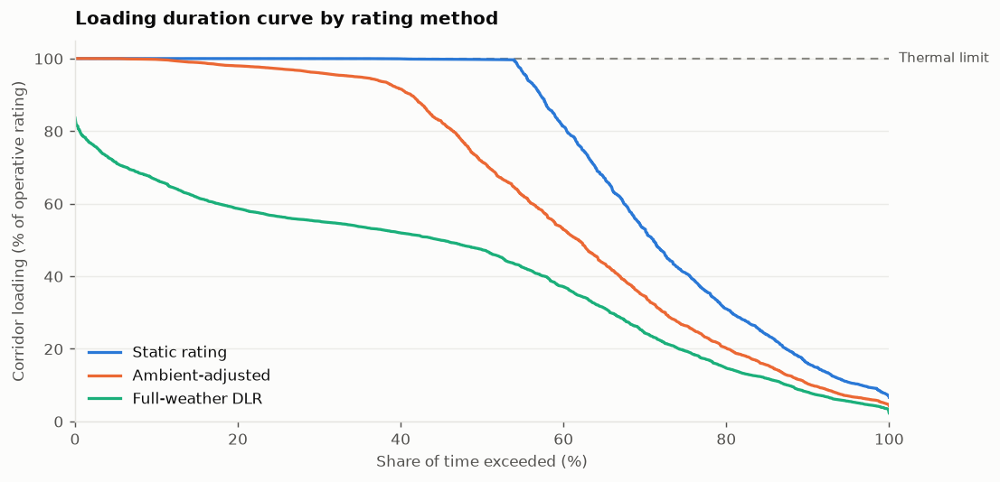
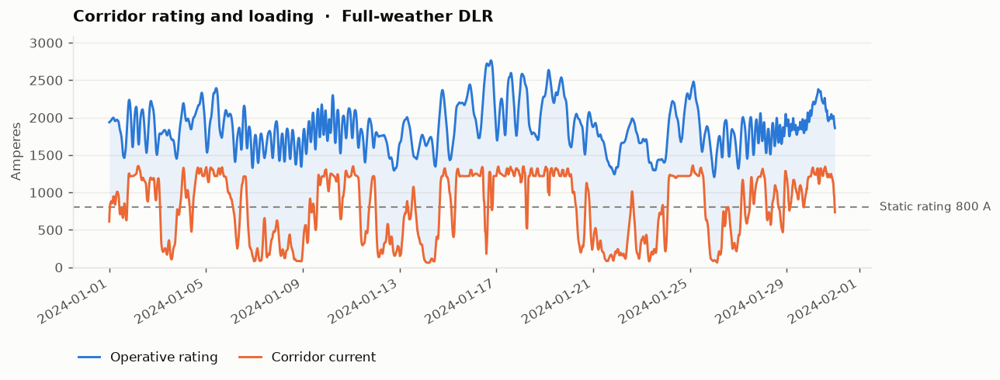
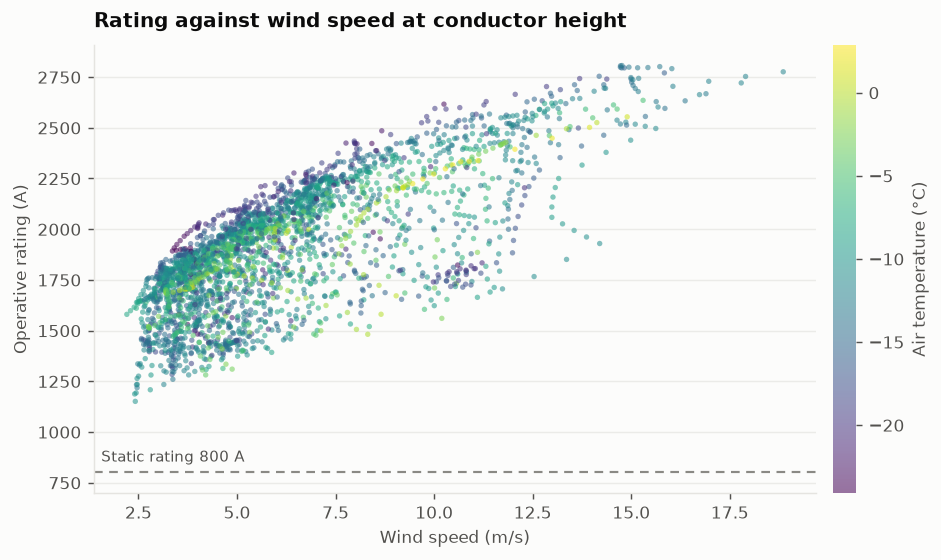
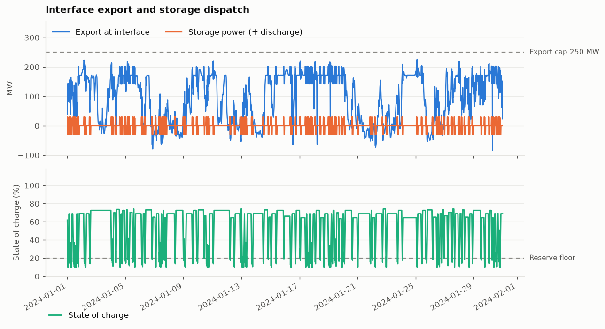

# DLR Hosting Capacity Simulator

[](https://github.com/OWNER/dlr-hosting-capacity-sim/actions/workflows/ci.yml)
[](https://www.python.org/)
[](LICENSE)

**How much renewable generation can an existing 110 kV corridor actually host,
and what does it cost to find out the answer with a static line rating?**

A quasi-static AC power-flow study of a congested export corridor: 330 MW of
wind and solar plus a 30 MW battery behind a corridor rated 152 MVA. It models
the physics that decide the answer — IEEE 738 conductor heat balance, a
coordinated voltage-control stack, and a minimal-curtailment search — at
15-minute resolution across a 21-scenario matrix. The dataset covers a full
reference year; the committed results use a 30-day window.

Everything here is generic and synthetic. The dataset is generated from a fixed
seed by a script in the repository.

---

## The result

**330 MW connected behind a corridor rated 152 MVA. 30-day winter window,
119 139 MWh available.**

| Corridor rating method | Mean operative rating | Curtailed | Delivered |
|---|---:|---:|---:|
| Static nameplate rating | 800 A | **20.9 %** | 94 249 MWh |
| Ambient-adjusted DLR | 1 232 A | **0.3 %** | 118 752 MWh |
| Full-weather DLR | 1 863 A | **0.0 %** | 119 139 MWh |
| Twin-bundle reconductoring | 1 600 A | **0.0 %** | 119 139 MWh |




**The static rating strands 24 891 MWh in a month — and almost all of it is a
measurement problem, not a conductor problem.** Rating the same conductor on
measured air temperature alone, holding wind at a conservative fixed value,
recovers 24 504 MWh of that: **98.4 % of what rebuilding the line with a twin
bundle would recover**, for the cost of a thermometer. Adding wind measurement
removes the constraint outright in this window.

Two further results the model produces rather than assumes:

* **The hosting-capacity knee is sharp.** Under the static rating the corridor
  absorbs the first two plants with 3.4 % curtailment, then the third takes it
  to 20.9 %. Congestion does not arrive gradually.
* **Adding storage made curtailment worse, not better** — 20.9 % to 23.2 %
  under the static rating. The battery sits near the receiving end, so
  discharging puts its output onto the same final corridor section that
  generation is already using, and because the battery is not curtailable, the
  plants are cut instead. Its grid-charging also pulls the interface voltage
  down, producing 89 hours below the lower band in the full-DLR case. Both are
  siting and control-strategy findings, and both are knobs
  (`storage_connection`, `storage_charge_source`), not fixed assumptions.



Full table: [`results/matrix_summary.csv`](results/matrix_summary.csv).


---

## Quickstart

```bash
git clone https://github.com/OWNER/dlr-hosting-capacity-sim
cd dlr-hosting-capacity-sim
pip install -e ".[dev]"

# one scenario: full-weather DLR, all plants, storage on
corridor-sim --preset dlr2_der4_bess --days 30

# the same corridor on a static rating, for comparison
corridor-sim --preset static_der4 --days 30

# the whole matrix in parallel, plus the comparison table and figures
python scripts/run_matrix.py --days 30 --jobs 8

pytest -q
```

The dataset ships with the repository, so nothing needs downloading. To rebuild
it: `python data/generate.py`.

Runs land in `runs/` (not committed — the full per-step time series is large).
`results/` holds the committed 30-day outputs: the comparison table, every
scenario's metrics, summary, seasonal breakdown and violation log, plus one
full time series compressed so the column schema can be inspected directly.
Regenerate it with `python scripts/publish_results.py`.

<details>
<summary>Command-line options</summary>

```
--preset PRESET      named scenario (see below)
--conductor {single,twin}
--dlr {0,1,2}        0 static, 1 ambient-adjusted, 2 full weather
--control {droop,cosphi}
--der WF_1,WF_2,...  which plants to connect
--storage            enable the battery
--no-curtailment     record what would bind instead of acting on it
--export-cap MW
--start YYYY-MM-DD --days N
--out DIR --label NAME --no-plots
```
</details>

---

## The corridor

```
 WF_3 72MW                          WF_1 90MW ─── WF_2 108MW
     │                                                  │
     │ 21 km                                     16 km  │
     ▼                                                  ▼
  SUB_A ══════ TAP_PV ══════════ TAP_W ══════ SUB_C ══════ TAP_B ══════ PCC ══> grid
  110/20kV  6km   │        8km          2.5km       16.5km   │      0.7km    │
     │            │ PV_1 60MW                                │ BESS 30MW      │ 15 km
   load           │                                          │ / 60 MWh       ▼
                  └── zone Z1 (110°) ──┴── zone Z2 (95°) ────┘              SUB_E
                                                                              │ 11 km
                     ══ constrained export corridor, 33.7 km               SUB_B
```

The double line is the binding constraint: 800 A static rating, 152 MVA, against
330 MW of connected generation. Full details in [docs/network.md](docs/network.md).

---

## What is modelled

### Dynamic line rating — IEEE 738-2012

Both directions of the heat balance are implemented. The forward solve fixes the
conductor at 80 °C and returns the ampacity the weather supports. The inverse
solve fixes the current the network is carrying and returns the temperature the
conductor reaches — the check that says whether a rating was actually safe.

Three rating modes share one model, so the comparison between them is
meaningful: the static rating is the *same* heat balance evaluated at the
reference conditions it is declared for, and the code asserts it reproduces the
declared rating to within 0.4 %. Wind is brought from 100 m down to conductor
height by a validated log law, and the corridor is split into two zones whose
different bearings give the same wind a different angle of attack.



The gap between the two lines is the headroom a static rating throws away. The
current spends much of the month above 800 A — every one of those quarter-hours
is curtailment under the static rating, and none of them are under DLR.



### Coordinated voltage control

| Actuator | Role | Deadband | Budget per interval |
|---|---|---|---|
| MV shunt reactor | fine, primary | ±0.18 kV | 4 steps |
| On-load tap changer | coarse, backup | ±0.50 kV | 3 taps |
| Plant reactive droop | continuous | ±0.010 pu | — |

The reactor acts first, the network is re-solved, and only then is the tap
changer tested against what remains — the same deadband on both produces a limit
cycle. Both freeze after reversing direction within an interval, because an
actuator that has reversed has bracketed its setpoint.

The droop loop re-solves after every reactive update, so recorded reactive power
is always a solved value rather than a command the network never saw.
Convergence requires both a settled voltage *and* a closed residual, and the
residual is written to every row so the claim is checkable. Each unit
under-relaxes adaptively, halving its damping on reversal.

At extreme loading the droop has no fixed point — a genuine property of a weak
corridor. The loop backtracks to the last solved state instead of failing, so a
timestep always ends solvable and curtailment can still act.

### Congestion management

Four constraint levels, all evaluated on every scan:

| | Constraint | Actionable |
|---|---|---|
| L1 | Over-voltage | yes |
| L2 | Under-voltage | no — cutting active power makes it worse |
| L3 | Thermal (corridor / distribution / plant, scanned separately) | yes |
| L4 | Export cap | yes |

Returning only the first violated level would let a non-actionable under-voltage
hide a coincident thermal overload, during exactly the hours that matter most.
Splitting thermal by asset owner is what stops a plant-owned transformer from
silently setting a network hosting capacity.

Curtailment is a one-dimensional monotone problem — total megawatts removed,
shared pro rata — so the search brackets the feasibility boundary, interpolates
on a signed margin, and applies **the smallest cut that clears**. The residual
bracket width is reported, so discretisation error is a number rather than an
unknown. Every curtailed megawatt-hour is attributed to exactly one cause.

### Storage and market layer

Two-phase dispatch: an intent set before the solve, reconciled against the export
headroom the solved network leaves. Generation has priority, so a delivery that
would breach the cap is clamped and the shortfall recorded. State of charge
integrates on realised power only, and when a limit clamps the result the
realised power is backed out of the actual energy change so the two stay
consistent.

Reach is asymmetric both ways: the battery cannot relieve a thermal overload
upstream of its tap, but it does share the final corridor section with
generation, so its output competes there. Holding a reserve and delivering
energy compete for the same asset; every interval records whether the reserve
fell short.



---

## Scenario matrix

21 scenarios: four rating-and-build options against increasing generation, each
with and without storage.

| | 1 plant | 2 plants | 3 plants | 4 plants | 4 + storage |
|---|---|---|---|---|---|
| **Static rating** | `static_der1` | `static_der2` | `static_der3` | `static_der4` | `static_der4_bess` |
| **Ambient-adjusted** | `dlr1_der1` | `dlr1_der2` | `dlr1_der3` | `dlr1_der4` | `dlr1_der4_bess` |
| **Full-weather DLR** | `dlr2_der1` | `dlr2_der2` | `dlr2_der3` | `dlr2_der4` | `dlr2_der4_bess` |
| **Twin conductor** | `twin_der1` | `twin_der2` | `twin_der3` | `twin_der4` | `twin_der4_bess` |

Plus `baseline`, the corridor with no generation connected. Each run writes a
time series, a violation log, a seasonal table, a metrics file and a summary;
`scripts/run_matrix.py` runs them in parallel and builds the comparison table.

---

## Repository layout

```
src/corridor_sim/
  config.py        immutable Config, preset table, CLI
  constants.py     network and physical parameters
  network.py       pandapower model
  dlr.py           IEEE 738 heat balance, three rating modes
  ders.py          wind power curve, shear, density correction
  dataio.py        input loading and time alignment
  controls.py      tap changer, reactor, droop, regulation loop
  constraints.py   four-level hierarchy, owner groups
  curtailment.py   minimal-curtailment search
  storage.py       battery dispatch, state of charge, reserve
  simulate.py      15-minute loop
  report.py        metrics, summaries, seasonal tables
  plots.py         figures
data/              synthetic dataset + its generator
scripts/           parallel matrix runner, results curation
results/           committed 30-day outputs
docs/              methodology, network description, figures
tests/             unit and end-to-end tests
```

---

## Verification

`pytest` covers the parts where a silent error would be most expensive:

* forward and inverse IEEE 738 solves agree — the current a rating permits heats
  the conductor to exactly the temperature the rating assumed;
* the model reproduces the declared static rating at its reference conditions;
* reactive power reported for a step matches what the solved network delivered;
* a non-actionable under-voltage does not mask a coincident thermal overload;
* the applied curtailment clears the violation and a meaningfully smaller cut
  does not;
* storage round-trip energy matches the stated efficiency, and clamped power
  matches the actual state-of-charge change;
* delivered plus curtailed energy equals available energy, every interval.

---

## Scope

The committed results cover a **30-day winter window**, which is the most
favourable month for dynamic line rating in this climate: cold, windy, and dark.
Read the uplift figures as a best case, not an annual average — a full year is
`--days 365`, and the seasonal table each run writes is there to make the
difference visible.

Quasi-static and intact-network: no contingency analysis, no protection or
stability study, no sag and clearance calculation — the design conductor
temperature stands in for the clearance limit that governs a real line. One
weather point represents the corridor, and each rating zone carries a single
mean bearing, so a per-span rating would come out lower. See
[docs/methodology.md](docs/methodology.md) for the full list.

## License

MIT — see [LICENSE](LICENSE).
