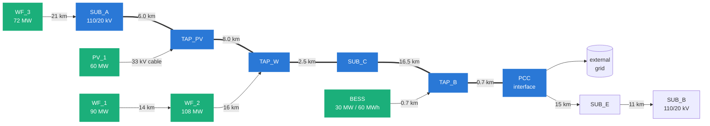

# The study corridor

A generic 110 kV sub-transmission corridor connecting a cluster of generation to
a stronger transmission network. All parameters are representative values from
public standards and typical datasheets.

The heavy path `SUB_A → PCC` is the constrained export corridor: everything the
plants generate reaches the grid through it. It is 33.7 km long and split into
two rating zones, `Z1` (`SUB_A → SUB_C`) and `Z2` (`SUB_C → PCC`), with mean
bearings 110° and 95°.

## Ratings and parameters

### Corridor conductor

ACSR of roughly 305 mm² aluminium over 39 mm² steel, 24 mm outside diameter,
80 °C design temperature.

| | Single | Twin bundle |
|---|---|---|
| Resistance at 50 °C | 0.0897 Ω/km | 0.0448 Ω/km |
| Reactance | 0.400 Ω/km | 0.290 Ω/km |
| Capacitance | 9.2 nF/km | 12.6 nF/km |
| Static rating | 800 A | 1600 A |
| Corridor capability | 152 MVA | 305 MVA |

Against a 330 MW fleet, the single conductor is the binding constraint by more
than a factor of two — which is the point of the study.

### Generation

| Plant | Rating | Connection | Reactive capability |
|---|---|---|---|
| WF_1 | 15 × 6 MW = 90 MW | 110 kV lateral via WF_2 | ±29.6 MVAr |
| WF_2 | 18 × 6 MW = 108 MW | 110 kV lateral to TAP_W | ±35.5 MVAr |
| WF_3 | 12 × 6 MW = 72 MW | 110 kV lateral to SUB_A | ±23.7 MVAr |
| PV_1 | 60 MW | 110/33 kV substation + 33 kV cable | ±19.7 MVAr |
| BESS | 30 MW / 60 MWh | 110/33 kV, 0.7 km tie | ±9.9 MVAr |

Reactive capability is the cos φ 0.95 grid-code minimum at rated active power.
The battery is four-quadrant and supplies reactive power at zero active power.

### Transformers

| Asset | Rating | Impedance | Tap changer |
|---|---|---|---|
| T_SUB_A1 | 25 MVA, 110/20 kV | 10.4 % | on-load, ±9 × 1.67 % |
| T_SUB_A2 | 16 MVA, 110/20 kV | 10.2 % | on-load, ±9 × 1.67 % |
| T_SUB_B | 25 MVA, 110/20 kV | 9.7 % | on-load, ±9 × 1.67 % |
| Wind step-up (×2 per farm) | 50 MVA natural / 63 MVA forced | 12.5 % on the 50 MVA base | fixed |
| T_PV | 75 MVA, 110/33 kV | 12.0 % | fixed |
| T_BESS | 40 MVA, 110/33 kV | 12.0 % | fixed |

Each wind farm has two parallel step-up units. Nameplate impedance is quoted on
the natural-cooling base and re-referred to whichever rating is enforced, so
switching between the two changes the loading percentage without changing the
network impedance — the two cases stay directly comparable. `wf_trafo_units=1`
gives the single-unit outage case.

### Limits

| | Value |
|---|---|
| Voltage band | 0.95 – 1.05 pu |
| Export cap at the interface | 250 MW |
| Reactive exchange window | ±33 MVAr (10 % of installed capacity) |
| External grid Thevenin impedance | 2.0 + j10.0 Ω |
| MV tap-changer setpoint | 20.5 kV |
| Shunt reactor | 11 steps, 0.50 – 3.00 MVAr |

## Topology invariance

Every element is built on every run. Disconnecting a plant sets its power to
zero rather than removing it from the network, so every scenario in the matrix
shares one topology and the comparison between them is clean. The alternative —
building a different network per scenario — makes it impossible to tell a
hosting-capacity difference from a topology difference.
